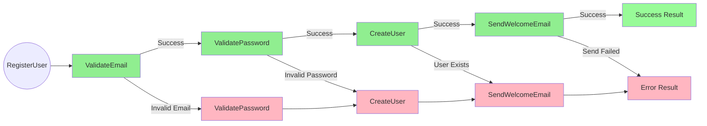
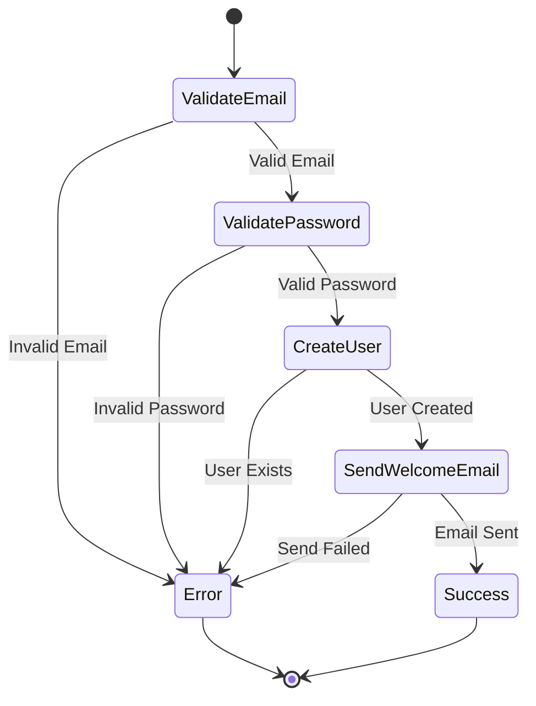
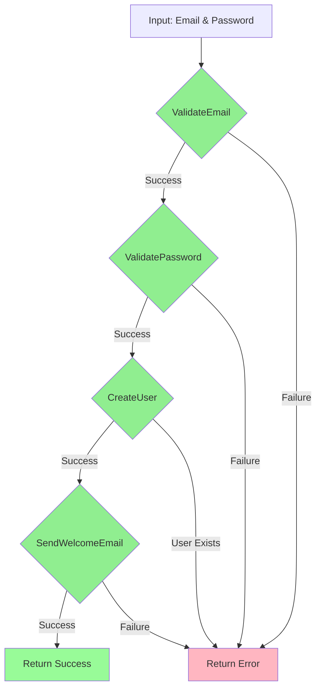

# Result Type for C#

[](https://github.com/[username]/resultType/actions/workflows/build.yml)

A functional approach to error handling in C# using the Result pattern, inspired by functional programming concepts like Railway-Oriented Programming.

## Overview

The Result type provides a robust and type-safe way to handle errors without throwing exceptions. It encapsulates both success and failure cases in a single type, making error handling explicit and helping prevent runtime errors.

### Key Features

- ✨ Type-safe error handling
- 🔒 Immutable result objects
- 🚂 Railway-oriented programming support
- 🎯 Explicit error paths
- 🔄 Method chaining
- 🧪 Comprehensive test coverage

### Benefits

1. **Explicit Error Handling**
   - No hidden exceptions
   - Clear error paths in code
   - Compile-time error checking

2. **Better Code Organization**
   - Separation of success and error paths
   - Cleaner method signatures
   - More maintainable code

3. **Improved Reliability**
   - Reduced runtime errors
   - Type-safe error propagation
   - Immutable result objects

## Core Implementation

### Result<TValue, TError>

The core type that encapsulates either a success value or an error:

```csharp
public readonly struct Result<TValue, TError>
{
    private readonly TValue? _value;
    private readonly TError? _error;
    private readonly bool _isError;

    // Implicit conversions for ergonomic usage
    public static implicit operator Result<TValue, TError>(TValue value) => new(value);
    public static implicit operator Result<TValue, TError>(TError error) => new(error);

    // Pattern matching and transformation methods
    public TResult Match<TResult>(
        Func<TValue, TResult> onSuccess,
        Func<TError, TResult> onError);

    public Result<TNewValue, TError> OnSuccess<TNewValue>(
        Func<TValue, Result<TNewValue, TError>> next);
}
```

### Error Record

A standardized way to represent errors:

```csharp
public record Error(string Code, string Message);
```

## Example: User Registration Service

The repository includes a practical example of using the Result type in a user registration service.

### Service Overview

```csharp
public class UserRegistrationService
{
    public Result<User, Error> RegisterUser(string email, string password)
    {
        return ValidateEmail(email)
            .OnSuccess(validEmail => ValidatePassword(password)
                .OnSuccess(validPassword => CreateUser(new UserData(validEmail, validPassword)))
                .OnSuccess(user => SendWelcomeEmail(user)));
    }
}
```

### Railway-Oriented Programming Visualization



### User Registration Flow



### Validation Chain

The registration process demonstrates Railway-Oriented Programming with a chain of validations:

1. **Email Validation**
   - Format checking
   - Domain validation
   - Uniqueness verification

2. **Password Validation**
   - Length requirements
   - Complexity rules
   - Special character checks

3. **User Creation**
   - Check for existing users
   - Hash password
   - Create user record

4. **Welcome Email**
   - Email service validation
   - Template validation
   - Email sending

### Validation Chain Flow



### Test Coverage

The example includes comprehensive tests demonstrating various scenarios:

```csharp
[Theory]
[InlineData("test@gmail.com", "Pass123!@#", true, true, null)]    // Success
[InlineData("test@gmail.com", "Pass123!@#", false, false, "NOTIFY_001")]  // Service unavailable
[InlineData("test@gmail.com", "Pass123!@#", true, false, "NOTIFY_002")]  // Template invalid
[InlineData("test@gmail.com", "Pass123!@#", false, false, "NOTIFY_001")] // Both failed
public void WhenEmailServiceOrTemplateValidation_ShouldBehaveCorrectly(
    string email, 
    string password, 
    bool emailServiceAvailable,
    bool emailTemplateValid,
    string? expectedErrorCode)
{
    var service = new UserRegistrationService(emailServiceAvailable, emailTemplateValid);
    var result = service.RegisterUser(email, password);
    Assert.Equal(true, result.HasResult());
    if (!result.HasResult())
    {
        Assert.Equal(expectedErrorCode, result.Error?.Code);
    }
}
```

### Test Scenarios

1. **Input Validation**
   - Valid/invalid email formats
   - Password complexity rules
   - Empty/null inputs

2. **Business Rules**
   - Unique email requirement
   - Allowed email domains
   - Password requirements

3. **External Services**
   - Email service availability
   - Template validation
   - Service error handling

4. **Edge Cases**
   - Email case normalization
   - Multiple registrations
   - Service failures

## Getting Started

1. Add the Result type to your project:
   ```csharp
   using ResultType;
   ```

2. Define your error types:
   ```csharp
   public static class Errors
   {
       public static Error InvalidEmail => new("VAL_001", "Invalid email format");
       public static Error WeakPassword => new("VAL_002", "Password too weak");
   }
   ```

3. Use in your methods:
   ```csharp
   public Result<User, Error> CreateUser(string email)
   {
       if (!IsValidEmail(email))
           return Errors.InvalidEmail;

       var user = new User(email);
       return user;
   }
   ```

## Contributing

Contributions are welcome! Please feel free to submit pull requests.

## License

This project is licensed under the MIT License - see the LICENSE file for details.
